# Video link: https://youtu.be/N7YIyw84dO8
# To reproduce the results, run the following commands in a terminal within the project directory:
1. make setup
2. make install
3. make interactive

Then run the python code with the following paramters:
#
===== Bike Trip Prediction Parameter Selection =====

Optimizer options:
1. Adam (adaptive learning rate)
2. RMSprop (good for RNNs)
3. SGD with momentum
Select optimizer (default=1): 2

Regularizer options:
1. L2 regularization (weight decay)
2. L1 regularization (sparse weights)
3. Combined L1 and L2 regularization
Select regularizer (default=1): 

Loss function options:
1. Mean Squared Error (standard)
2. Mean Absolute Error (less sensitive to outliers)
3. Huber Loss (combines MAE and MSE benefits)
4. Symmetric Mean Absolute Percentage Error (scale-invariant)
Select loss function (default=1): 

Batch size (default=32): 16

Dropout rate (0.0-0.9, default=0.4): 0.3

Regularization strength (default=0.001): 

Learning rate (default=0.0005): 

Training epochs (default=20): 

Use ensemble model for weekday/weekend? (y/n, default=n): y

Skip feature importance analysis? (y/n, default=n): y

- **Note:** The model will take a few minutes to train, depending on your hardware. First, it will show the results and plots for the weekday model, then the weekend model. And finally, it will show the results and plots for the ensemble model. You will need to close the plots to continue the training process. You may enable the feature importance analysis by selecting 'y' when prompted, but this will take significantly longer to run. 

- **final_enhanced_predict2h.py is the main script that runs the final model**

# Bluebikes Hourly Trip Prediction  
*Predicting hourly bike-share ridership using weather and time features*

## Overview  
I am developing a model to predict the number of Bluebikes trips each hour using historical usage and weather data. The goal is to capture how factors like time of day and weather conditions influence bike-share demand for Blue Bikes, previously Hubway. 

## Data  
I aggregated the historical trip data from the Hubway/Bluebikes bike-share system on an hourly basis. Each hourly record includes the trip count along with weather metrics (temperature, humidity, precipitation, etc.) retrieved from the OpenWeather One Call API, matched by timestamp. I also added basic time attributes (e.g. hour of day, day of week, and a weekend indicator) to the dataset. 

## Model  
My predictive model uses a bidirectional LSTM network with an attention mechanism for sequence-to-one forecasting. Initially, my model would use sequences of the last 12 hours of data and output a single prediction for the next hour. 

I have since experimented with different prediction horisons, such as 24, 12, 6, and 3 hours, however, I ended up deciding to use a 2-hour prediction horison, as I felt this was the perfect balance between maintaining very high accuracy, R²: 0.8664, while allowing enough time for the model to be useful in real-world applications. This should allow the model to be used for short-term planning and resource allocation and give blue bikes enough time to move bikes around in the event of unexpectedly high demand.

The attention layer helps the model focus on the most relevant time steps in the input sequence. To account for different ridership patterns on weekdays versus weekends, I trained two separate LSTM models and combined them as an ensemble (selecting the weekday model or weekend model based on the day type).

## Results  

## Ensemble vs Single Model

I compared the performance of the ensemble model (weekday + weekend) against a single model trained on the entire dataset. The ensemble model outperformed the single model, achieving a higher R² score and lower RMSE. This indicates that separating weekday and weekend patterns allows for better predictions.

- Single Model:
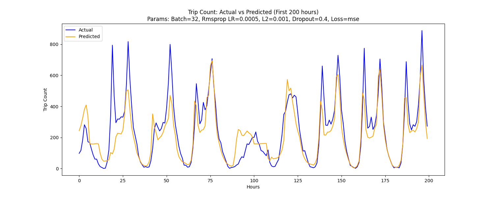
MAE: 122.14
RMSE: 186.54
R²: 0.8341

- Ensemble Model:
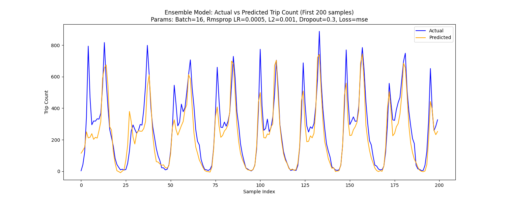
MAE: 110.51
RMSE: 167.38
R²: 0.8664

### Training History
The training history plot shows the model’s loss steadily decreasing and converging after around 20 epochs. The training and validation loss curves closely track each other, indicating minimal overfitting.

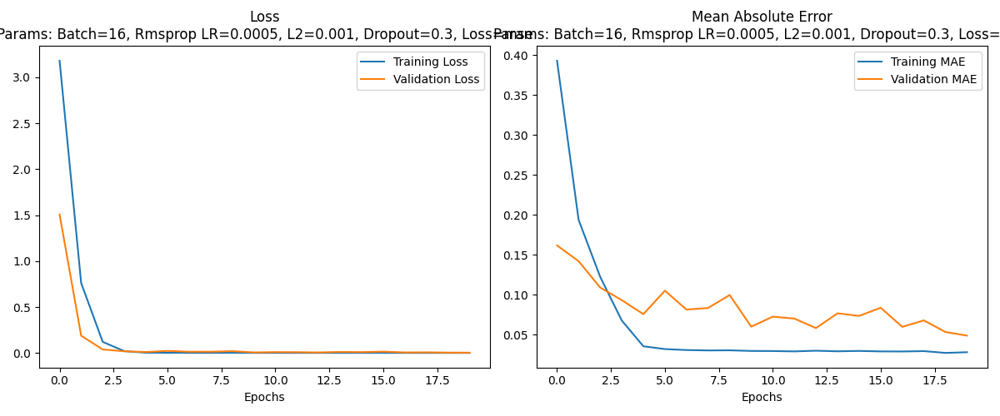

### Feature Importance
The feature importance analysis suggests that time-based features and key weather features had a great influence on the predictions. Interestingly, when we compare the feature importance of the weekday and weekend models, we see that some features are more important on weekdays than weekends and vice versa. 

For example, the trip count lag 12 hours is more important on weekdays, while the trip count diff 1 hour is more important on weekends. This indicates that users are more likely to use the bike share system in a predictable manner on weekdays, when commuting, while weekend usage is more erratic and less predictable, for pleasure.

- Weekday Feature Importance:
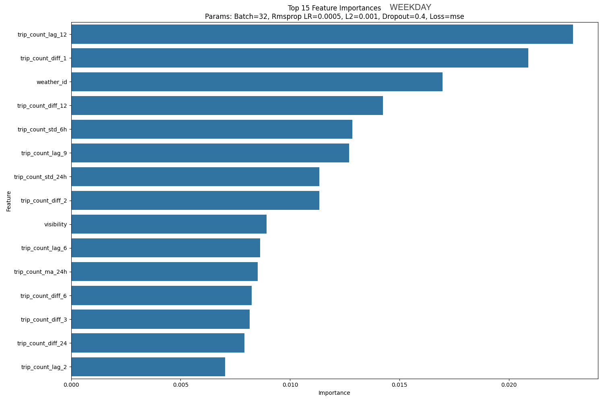
- **trip_count_lag_12:** The trip count 12 hours before the current hour. Captures daily patterns.
- **trip_count_diff_1:** Immediate change in trip count from one hour earlier. Captures short-term trends.
- **weather_id:** Numeric code indicating weather conditions (clear, clouds, rain, etc.). Directly affects biking demand.
- **trip_count_diff_12:** Change in trip count from 12 hours earlier, comparing current demand to half-day earlier.
- **trip_count_std_6h:** Rolling standard deviation of trips over the past 6 hours, capturing short-term volatility.
- **trip_count_lag_9:** Trip count from 9 hours ago, indicating mid-day cycles.
- **trip_count_std_24h:** 24-hour rolling standard deviation, measuring full-day demand variability.
- **trip_count_diff_2:** Change in trip count from two hours earlier, identifying trends slightly beyond immediate.
- **visibility:** Atmospheric visibility; lower values signal adverse conditions (fog/rain), reducing usage.
- **trip_count_lag_6:** Trip count 6 hours earlier, capturing intra-day usage cycles.
- **trip_count_ma_24h:** 24-hour rolling mean, providing a daily baseline of usage.
- **trip_count_diff_6:** Change from six hours earlier, capturing intra-day demand shifts.
- **trip_count_diff_3:** Change from three hours earlier, identifying intermediate-term trends.
- **trip_count_diff_24:** Change from 24 hours earlier, capturing daily cyclicality.
- **trip_count_lag_2:** Trip count from 2 hours ago, showing very recent historical usage.

- Weekend Feature Importance:
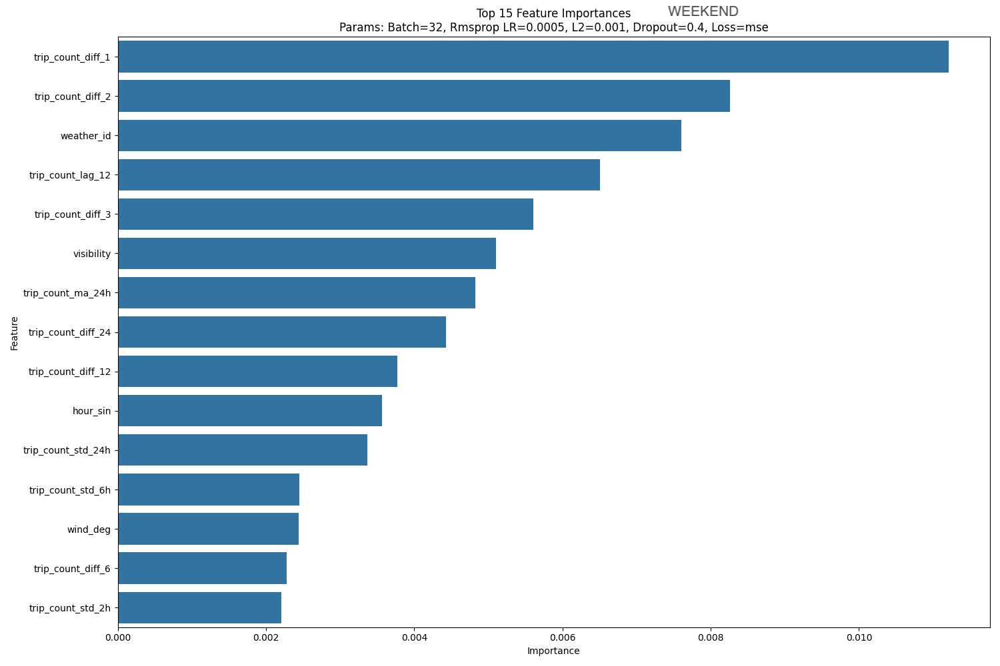
- **trip_count_diff_1:** Immediate hourly change in trips, directly reflecting rapid fluctuations.
- **trip_count_diff_2:** Two-hour trend in trip count, identifying building or declining demand.
- **weather_id:** Numeric weather condition code; influences ridership significantly.
- **trip_count_lag_12:** Historical trip count 12 hours earlier; provides half-day contextual insight.
- **trip_count_diff_3:** Change from three hours earlier, capturing recent demand trends.
- **visibility:** Weather-based visibility measurement; lower visibility generally reduces usage.
- **trip_count_ma_24h:** 24-hour rolling average; represents typical daily demand levels.
- **trip_count_diff_24:** Difference from 24 hours earlier, highlighting day-to-day patterns.
- **trip_count_diff_12:** Change from 12 hours earlier, representing shifts within half a day.
- **hour_sin:** Sine-transformed hour of day; cyclical encoding of daily time, captures daily rhythms.
- **trip_count_std_24h:** Standard deviation over 24 hours; measures daily usage variability.
- **trip_count_std_6h:** Rolling 6-hour standard deviation; identifies recent short-term fluctuations.
- **wind_deg:** Wind direction; subtle influence on biking comfort (e.g., headwinds vs. tailwinds).
- **trip_count_diff_6:** Change in trips from six hours ago; indicates medium-term shifts.
- **trip_count_std_2h:** Standard deviation of last 2 hours; captures immediate short-term volatility.

### Residual Plot
The residual plot indicates that prediction errors are mostly centered around zero, with no strong bias.

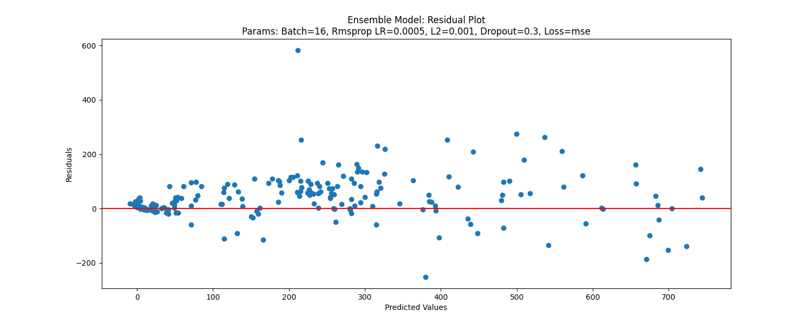

### Prediction Results
The prediction results plot shows that the model’s forecasts closely follow the actual trip counts over time.

### Batch Size Comparison  
I experimented with batch sizes of 16, 32, 64, and 128 to observe their impact on model training. Smaller batches (like 16) update the model more frequently each epoch, which can help capture patterns and improve generalization. Indeed, the model trained with batch size 16 achieved the lowest validation error and produced predictions closest to the actual values. In contrast, larger batch sizes (such as 64 or 128) converged more slowly and tended to settle at a higher error, likely due to the less frequent weight updates. Thus, batch size 16 provided the best overall performance and was used for the final model.

- Batch Size 8:
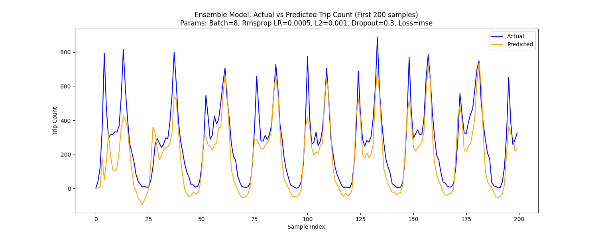

- Batch Size 16:  

- Batch Size 32:  
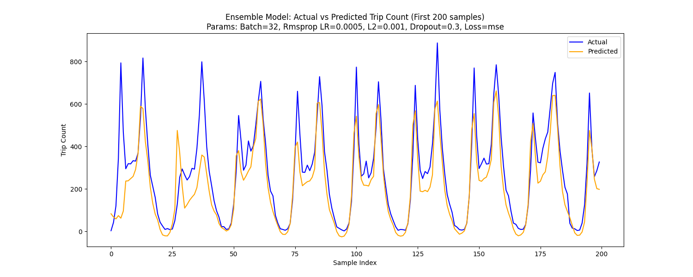

- Batch Size 64:  
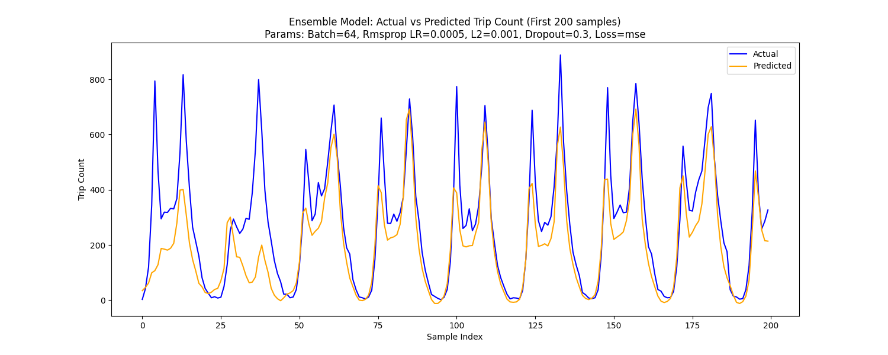

- Batch Size 128:  
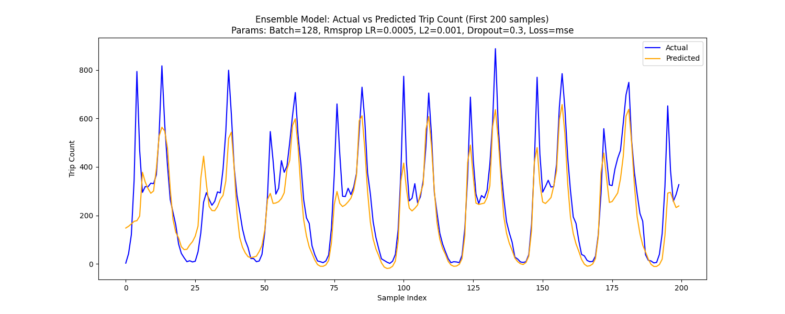

### Dropout Rates  
I tested a range of dropout rates (from 0.2 up to 0.5) to find the right balance between overfitting and underfitting. Dropout helps prevent overfitting by randomly dropping neurons during training—if the rate is too low, the model may still overfit, whereas too high a rate can hinder learning by removing too much information. The experiments showed that a moderate dropout around 20–30% (0.2–0.3) strikes the best balance. At these moderate dropout levels, the model generalized well and maintained strong validation performance, whereas higher dropout (like 0.4 or 0.5) caused the model to underfit and lose accuracy. Thus, a moderate dropout rate (~0.2–0.3) was ideal for this model.

- Dropout 0.2:  
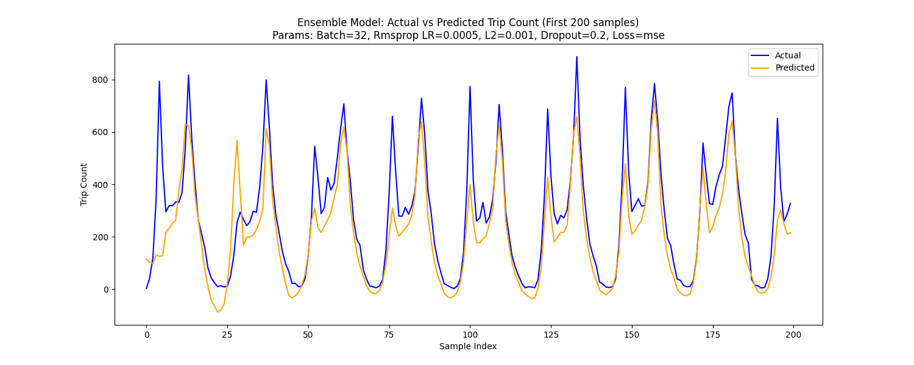

- Dropout 0.25:  
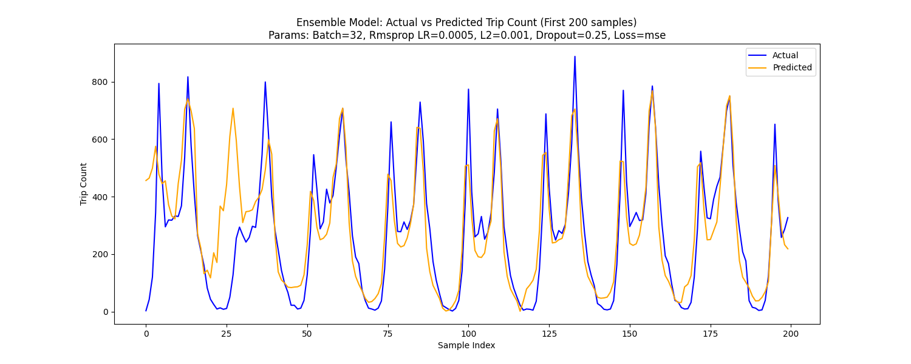

- Dropout 0.3:  
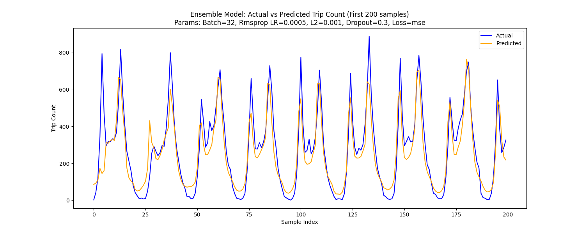

- Dropout 0.35:  
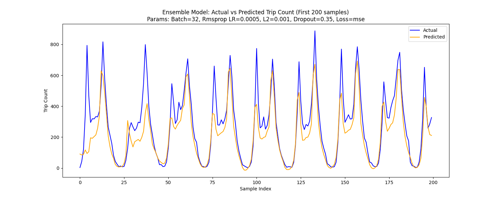

- Dropout 0.4:  
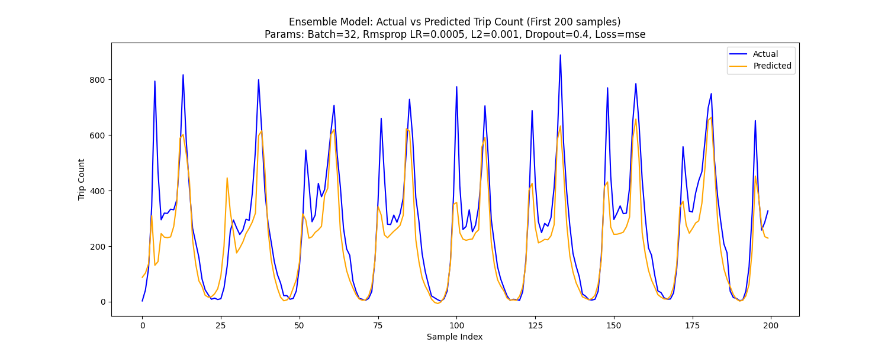

- Dropout 0.5:  
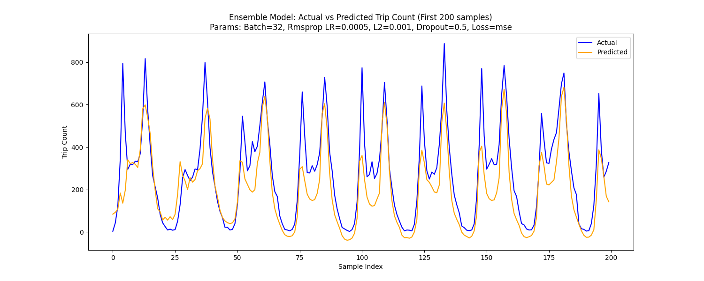

### Loss Functions  
I compared two loss functions for training the model: Mean Squared Error (MSE) and Symmetric Mean Absolute Percentage Error (SMAPE). MSE computes the average of squared prediction errors, which heavily penalizes larger mistakes, whereas SMAPE calculates the error as a percentage of the actual values (treating large and small values more uniformly). In practice, the model trained with MSE achieved a lower validation error and more stable learning than the model trained with SMAPE. MSE likely worked better for this problem because it pushed the model to reduce big errors (capturing high ridership spikes), whereas SMAPE’s relative error metric made it less sensitive to those large deviations. Therefore, MSE was the more effective loss function and was used in the final model.

- MSE:  

- SMAPE:  
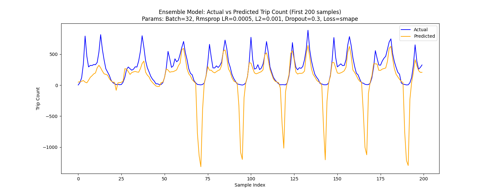

### Optimizers  
I tried three optimization algorithms—Stochastic Gradient Descent (SGD), RMSprop, and Adam—to see which yielded the best results. RMSprop and Adam use adaptive learning rate strategies (with Adam also incorporating momentum), which generally help them converge faster than the fixed learning rate of standard SGD. Indeed, RMSProp delivered the best performance in my experiments, converging quickly and attaining the lowest validation loss. Adam was a close second, while SGD was significantly slower to converge and yielded a higher error. Based on these outcomes, I chose Adam as the optimizer for the final model.

- Adam:  
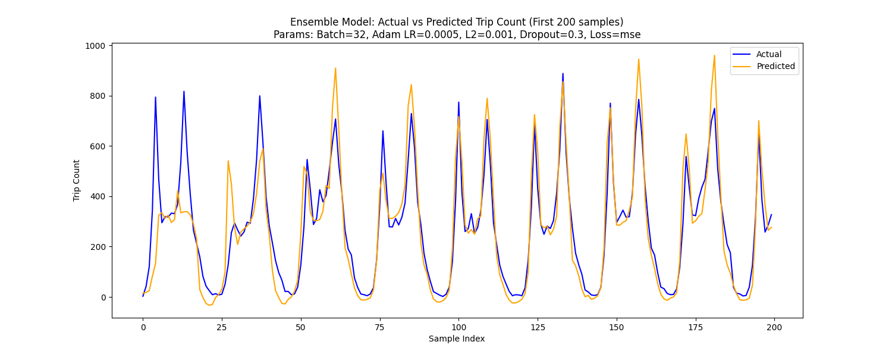

- RMSprop:  

- SGD:  
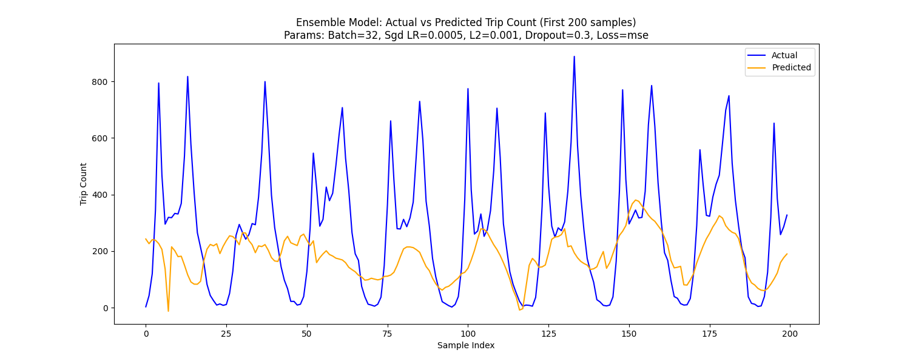

## Conclusion
Overall, the model performed well in predicting hourly bike-share ridership, achieving a high R² score and low RMSE. The feature importance analysis provided valuable insights into the factors influencing bike-share demand, highlighting the significance of time-based features and weather conditions. The ensemble approach of using separate models for weekdays and weekends improved prediction accuracy, demonstrating the importance of capturing different usage patterns.

I would like to further explore the model's performance in real-world applications and consider additional features or data sources to enhance its predictive capabilities. Future work could also involve deploying the model in a production environment and integrating it with real-time data streams for dynamic predictions.
