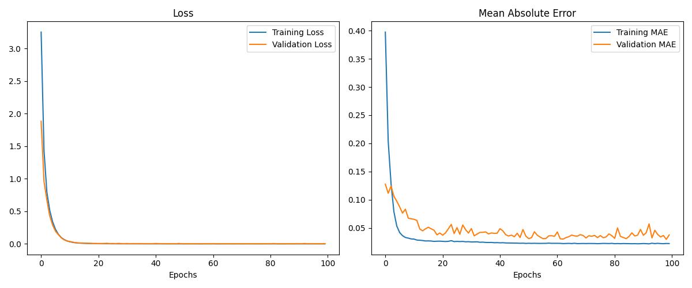
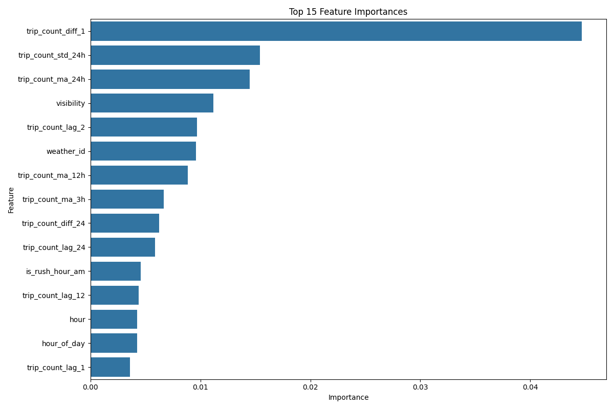
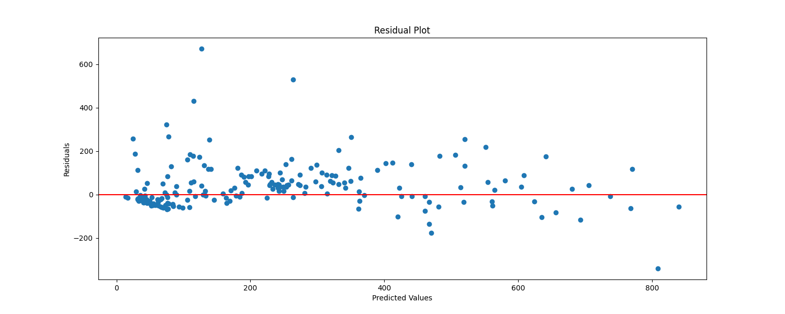
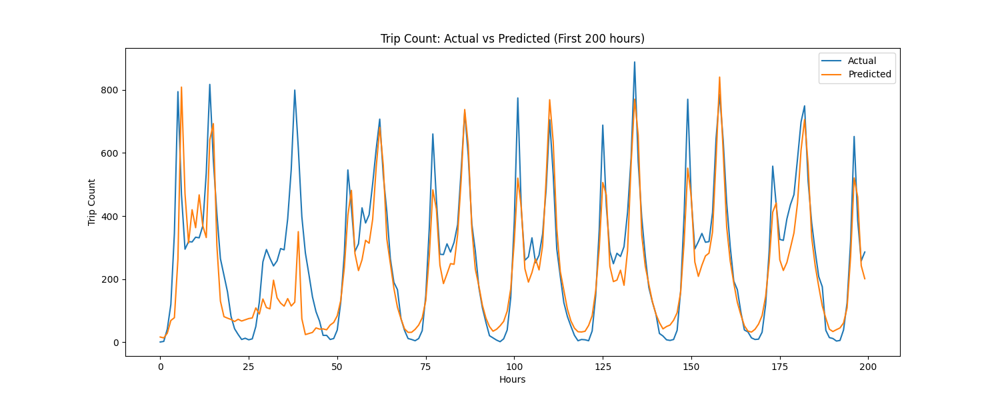

# Video link: https://youtu.be/t9maCmvRA4U

# Bluebikes Hourly Trip Prediction  
*Predicting hourly bike-share ridership using weather and time features*

## Overview  
I am developing a model to predict the number of Bluebikes trips each hour using historical usage and weather data. The goal is to capture how factors like time of day and weather conditions influence bike-share demand. So far, I have built a data processing pipeline and a deep learning model that demonstrates the feasibility of these predictions.

## Data  
I aggregated the historical trip data from the Hubway/Bluebikes bike-share system on an hourly basis. Each hourly record includes the trip count along with weather metrics (temperature, humidity, precipitation, etc.) retrieved from the OpenWeather One Call API, matched by timestamp. I also added basic time attributes (e.g. hour of day, day of week, and a weekend indicator) to the dataset. The model uses a rolling window of the past 12 hours of data as input features to predict the next hour’s trip count.

## Model  
My predictive model uses a bidirectional LSTM network with an attention mechanism for sequence-to-one forecasting. It processes sequences of the last 12 hours of data and outputs a single prediction for the next hour. The attention layer helps the model focus on the most relevant time steps in the input sequence. To account for different ridership patterns on weekdays versus weekends, I trained two separate LSTM models and combined them as an ensemble (selecting the weekday model or weekend model based on the day type).

## Results  
- **Training History:** The training history plot shows the model’s loss steadily decreasing and converging after around 20 epochs, with training and validation curves closely tracking each other (indicating minimal overfitting).  
    
- **Feature Importance:** The feature importance plot suggests that time-based features (such as hour of day and whether it is a weekend) and key weather features (like temperature) had the greatest influence on the predictions.  
    
- **Residual Plot:** The residual plot indicates that prediction errors are mostly centered around zero, with no strong bias. A few larger errors occur during periods of unusual or peak usage, but overall the residuals are fairly well-distributed.  
    
- **Prediction Results:** The prediction results plot shows that the model’s forecasts closely follow the actual trip counts over time. The model captures the daily usage trends and peaks reasonably well, though it sometimes underestimates sudden spikes in demand.  
    

## Next Steps  
I’m planning to edit or possibly overhaul the model to make it more understandable and more useful in practical settings. Specifically, I want to develop a version that can predict hourly trip counts using only weather data, the date, and time-based features like whether it’s a holiday, weekend, or rush hour. The goal is to create a model that doesn’t rely on recent trip history, so it can be used in advance to help systems like Bluebikes plan for demand. For example, if the model predicts high ridership on a sunny Saturday, Bluebikes could proactively ensure bikes are well-distributed and available.